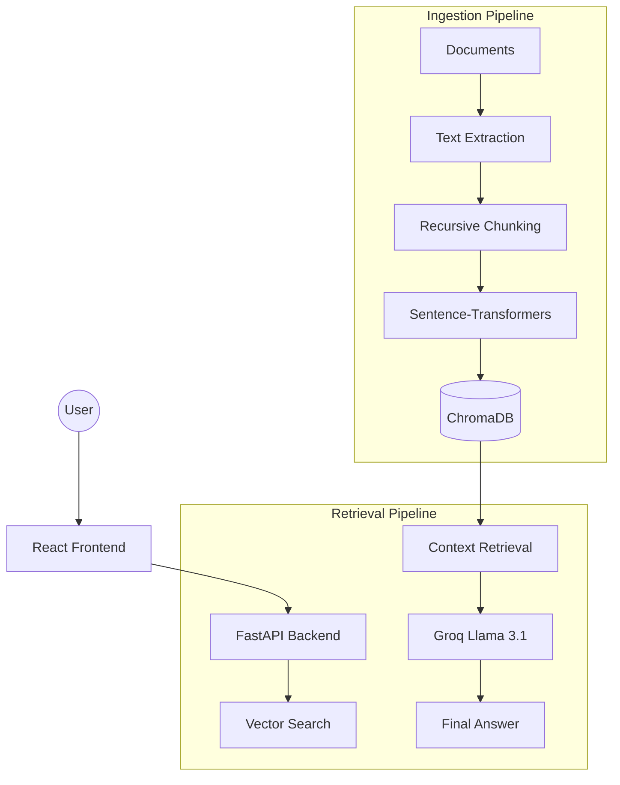

# 🧠 DocuMind v2.0
### AI-Powered Document Intelligence & Retrieval-Augmented Generation (RAG)

[](https://fastapi.tiangolo.com/)
[](https://reactjs.org/)
[](https://groq.com/)
[](https://www.trychroma.com/)
[](https://tailwindcss.com/)

DocuMind v2.0 is a state-of-the-art document interaction platform that leverages **Groq's Llama 3.1** and **ChromaDB** to provide lightning-fast, context-aware conversations with your PDF, TXT, and DOCX files.

---

## 🚀 Key Features

*   **⚡ Blazing Fast Inference**: Powered by Groq for near-instant AI responses.
*   **🔍 Semantic Search**: ChromaDB vector store ensures high-precision context retrieval.
*   **📄 Multi-Format Support**: Intelligent processing for PDF, DOCX, and TXT files.
*   **🛡️ Privacy First**: Local embedding generation using `sentence-transformers`.
*   **🎨 Premium UI**: Sleek, responsive interface built with React and Tailwind CSS.
*   **🔗 Source Attribution**: Verifiable answers with direct links to document chunks.

---

## 🏗️ Technical Architecture



---

## 🛠️ Quick Start

### 1. Prerequisites
- Python 3.11+
- Node.js 18+
- [Groq API Key](https://console.groq.com)

### 2. Clone & Configure
```bash
git clone https://github.com/daudx/DOCUMIND-V2.git
cd DOCUMIND-V2
cp .env.example .env
```

### 3. Backend Setup
```bash
cd backend
python -m venv venv
# Windows
.\venv\Scripts\activate
# Install
pip install -r requirements.txt
# Launch
python app/main.py
```

### 4. Frontend Setup
```bash
cd frontend
npm install
npm run dev
```

---

## ⚙️ Configuration (.env)

| Variable | Description | Default |
| :--- | :--- | :--- |
| `GROQ_API_KEY` | Your Groq API Key | Required |
| `GROQ_MODEL` | LLM Model Name | `llama-3.1-8b-instant` |
| `EMBEDDING_MODEL` | Sentence Transformer Model | `all-MiniLM-L6-v2` |
| `CHUNK_SIZE` | Character count per chunk | `1000` |

---

## 🤝 Support & Contributing

- 🐛 **Bug Reports**: [Open an Issue](https://github.com/daudx/DOCUMIND-V2/issues)
- 💬 **Discussions**: [Join the Conversation](https://github.com/daudx/DOCUMIND-V2/discussions)

---

**Made with ❤️ by [daudx](https://github.com/daudx)**
_DocuMind v2.0 - Bridging the gap between documents and intelligence._
