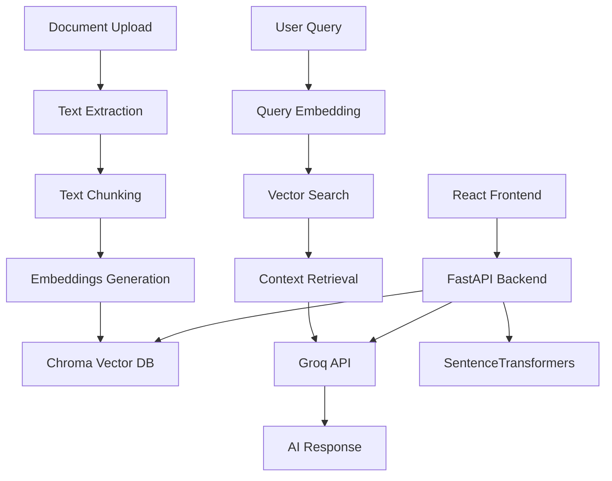

# DocuMind v2.0 - AI Document Intelligence Platform

[](https://fastapi.tiangolo.com/)
[](https://reactjs.org/)
[](https://groq.com/)
[](https://www.trychroma.com/)

> 🚀 **Lightning-fast document interaction platform powered by Groq's LLama 3 and Chroma vector database**

DocuMind v2.0 enables you to upload documents (PDF, TXT, DOCX) and have intelligent conversations with your content using cutting-edge AI technology.


## ✨ Features

### 🔥 **Core Capabilities**

- **Multi-format Support**: PDF, TXT, and DOCX processing
- **Lightning-fast AI**: Groq's Llama 3 8B for instant responses
- **Smart Search**: Chroma vector database with semantic similarity
- **Source Attribution**: Every answer shows relevant document chunks
- **Real-time Chat**: Interactive Q&A with confidence scores

### 🛠️ **Technical Highlights**

- **Local Embeddings**: No API costs for document processing
- **Persistent Storage**: Chroma database maintains your document library
- **Async Processing**: Non-blocking document upload and chat
- **Modern UI**: React + Tailwind CSS with responsive design
- **Production Ready**: Docker support and deployment configurations

## 🏗️ Architecture



## 🚀 Quick Start

### Prerequisites

- **Python 3.11+**
- **Node.js 18+**
- **Groq API Key** (free at [console.groq.com](https://console.groq.com))

### 1. Clone Repository

```bash
git clone https://github.com/yourusername/documind-v2
cd documind-v2
```

### 2. Setup Environment

```bash
# Copy environment template
cp .env.example .env

# Edit .env and add your Groq API key
# GROQ_API_KEY=your_groq_api_key_here
```

### 3. Backend Setup

```bash
# Navigate to backend
cd backend

# Create virtual environment
python -m venv venv
.\venv\Scripts\activate 
 # On Windows: venv\Scripts\activate

# Install dependencies
pip install -r requirements.txt

# Run the backend
python app/main.py
```

Backend will start at `http://localhost:8000`

### 4. Frontend Setup

```bash
# Open new terminal and navigate to frontend
cd frontend

# Install dependencies
npm install

# Start development server
npm run dev
```

Frontend will start at `http://localhost:3000`

## 🐳 Docker Setup (Recommended)

### Option 1: Docker Compose (Easiest)

```bash
# Clone and configure
git clone https://github.com/yourusername/documind-v2
cd documind-v2
cp .env.example .env

# Edit .env with your Groq API key
# Then start everything
docker-compose up --build
```

### Option 2: Manual Docker

```bash
# Build backend
docker build -t documind-backend ./backend

# Run backend
docker run -p 8000:8000 --env-file .env documind-backend

# Build frontend
docker build -t documind-frontend ./frontend

# Run frontend
docker run -p 3000:3000 documind-frontend
```

## 📖 Usage Guide

### 1. **Upload Documents**

- Click "Upload" tab in sidebar
- Drag & drop or browse for files
- Supports PDF, TXT, DOCX (up to 50MB)
- Processing creates embeddings automatically

### 2. **Start Chatting**

- Select document from "Docs" tab
- Ask questions in natural language
- Get AI responses with source citations
- View confidence scores and chunk references

### 3. **Example Queries**

```
• "What is this document about?"
• "Summarize the key findings"
• "Find information about machine learning"
• "What are the main conclusions?"
• "Explain the methodology used"
• "Compare the results in sections 3 and 4"
```

## 🔧 API Documentation

Once running, visit:

- **Interactive Docs**: `http://localhost:8000/docs`
- **OpenAPI Schema**: `http://localhost:8000/openapi.json`

### Key Endpoints

| Method | Endpoint         | Description             |
| ------ | ---------------- | ----------------------- |
| `POST` | `/api/upload`    | Upload document         |
| `GET`  | `/api/documents` | List all documents      |
| `POST` | `/api/chat`      | Send chat message       |
| `POST` | `/api/search`    | Search across documents |
| `GET`  | `/api/health`    | Health check            |

## ⚙️ Configuration

### Environment Variables

```bash
# Required
GROQ_API_KEY=your_key_here

# Optional (with defaults)
GROQ_MODEL=llama3-8b-8192
MAX_TOKENS=1000
TEMPERATURE=0.1
EMBEDDING_MODEL=all-MiniLM-L6-v2
CHUNK_SIZE=1000
CHUNK_OVERLAP=200
MAX_FILE_SIZE_MB=50
```

### Performance Tuning

```bash
# For better performance
EMBEDDING_BATCH_SIZE=64  # Larger batches
VECTOR_SEARCH_RESULTS=10  # More context
SIMILARITY_THRESHOLD=0.2  # Lower threshold

# For production
DEBUG=false
LOG_LEVEL=WARNING
SAVE_ORIGINAL_FILES=true
```

## 🚀 Deployment

### Vercel Frontend Deployment

```bash
# Build frontend
cd frontend
npm run build

# Deploy to Vercel
npx vercel --prod
```

### Backend Deployment Options

**Railway:**

```bash
# Install Railway CLI
npm install -g @railway/cli

# Deploy
railway login
railway init
railway up
```

**Render:**

- Connect your GitHub repo
- Set environment variables
- Deploy automatically

**Google Cloud Run:**

```bash
# Build and deploy
gcloud builds submit --tag gcr.io/PROJECT-ID/documind
gcloud run deploy --image gcr.io/PROJECT-ID/documind --platform managed
```

## 🛠️ Development

### Project Structure

```
documind-v2/
├── backend/
│   ├── app/
│   │   ├── main.py              # FastAPI app
│   │   ├── models/              # Pydantic schemas
│   │   ├── routers/             # API routes
│   │   ├── services/            # Business logic
│   │   └── utils/               # Utilities
│   ├── requirements.txt
│   └── Dockerfile
├── frontend/
│   ├── src/
│   │   ├── App.jsx              # Main React component
│   │   ├── main.jsx             # Entry point
│   │   └── index.css            # Tailwind styles
│   ├── package.json
│   └── vite.config.js
├── docker-compose.yml
├── .env.example
└── README.md
```

### Adding New Features

1. **Backend**: Add routes in `routers/`, logic in `services/`
2. **Frontend**: Add components in `src/components/`
3. **Database**: Extend schemas in `models/`

### Running Tests

```bash
# Backend tests
cd backend
pytest

# Frontend tests
cd frontend
npm test
```

## 🐛 Troubleshooting

### Common Issues

**"Groq API error"**

```bash
# Check API key
echo $GROQ_API_KEY

# Test API directly
curl -H "Authorization: Bearer $GROQ_API_KEY" https://api.groq.com/openai/v1/models
```

**"ChromaDB errors"**

```bash
# Clear database
rm -rf ./data/chroma

# Restart services
docker-compose restart
```

**"Frontend connection issues"**

```bash
# Check backend is running
curl http://localhost:8000/api/health

# Check CORS settings in backend
```

**"Out of memory during embedding"**

```bash
# Reduce batch size
export EMBEDDING_BATCH_SIZE=16

# Or use smaller model
export EMBEDDING_MODEL=all-MiniLM-L12-v2
```

### Performance Issues

1. **Slow embeddings**: Use GPU-enabled containers
2. **Large documents**: Increase chunk size
3. **Memory usage**: Monitor and adjust batch sizes

## 📊 Monitoring

### Health Checks

```bash
# Backend health
curl http://localhost:8000/api/health

# Check stats
curl http://localhost:8000/api/stats
```

### Logs

```bash
# Docker logs
docker-compose logs -f backend
docker-compose logs -f frontend

# Local development
tail -f ./logs/app.log
```

## 🤝 Contributing

1. Fork the repository
2. Create feature branch (`git checkout -b feature/amazing-feature`)
3. Commit changes (`git commit -m 'Add amazing feature'`)
4. Push to branch (`git push origin feature/amazing-feature`)
5. Open Pull Request

### Development Guidelines

- Follow PEP 8 for Python code
- Use ESLint for JavaScript/React
- Add tests for new features
- Update documentation

## 📝 License

This project is licensed under the MIT License - see the [LICENSE](LICENSE) file for details.

## 🙏 Acknowledgments

- **[Groq](https://groq.com)** - Lightning-fast LLM inference
- **[Chroma](https://www.trychroma.com)** - Vector database excellence
- **[Sentence Transformers](https://www.sbert.net)** - Powerful embeddings
- **[FastAPI](https://fastapi.tiangolo.com)** - Modern Python web framework
- **[React](https://reactjs.org)** - UI framework
- **[Tailwind CSS](https://tailwindcss.com)** - Utility-first styling

## 📞 Support

- 🐛 **Bug Reports**: [Create Issue](https://github.com/yourusername/documind-v2/issues)
- 💬 **Discussions**: [GitHub Discussions](https://github.com/yourusername/documind-v2/discussions)
- 📧 **Email**: support@documind.ai
- 🌐 **Website**: [documind.ai](https://documind.ai)

---

**Made with ❤️ for the developer community**

_DocuMind v2.0 - Where documents meet intelligence_
